# ATS Resume Analyzer - Test Execution Report

This report consolidates the automated test suite results and high-concurrency performance load testing metrics for the **ATS Resume Analyzer** platform. 

> [!NOTE]
> All functional tests (mobile and web) achieved a **100% pass rate**. The Flask backend demonstrated high resilience under a simulated load of 100 concurrent virtual users, maintaining a **100% success rate (200 OK)** with zero failed requests.

---

## 📊 Combined Test Suite Overview

| Test Suite | Platform/Environment | Framework | Test Cases | Passed | Failed | Pass Rate | Total Duration |
| :--- | :--- | :--- | :---: | :---: | :---: | :---: | :---: |
| **Mobile App** | Android (Pixel 5 Emulator) | Appium | 10 | 10 | 0 | **100%** | 27.7 sec |
| **Web App** | Chrome Desktop (1920x1080) | Selenium | 10 | 10 | 0 | **100%** | 31.6 sec |
| **Load Test** | localhost:5000/health | Custom HTTP Threaded | 6,845 | 6,845 | 0 | **100%** | 60.0 sec |

---

## 📱 Mobile App Test Results (Appium - Android)

The mobile test suite was executed against the Flutter Android APK containing a WebView wrapper for the React frontend, simulating a standard user's journey.

| # | Test Category | Test Name | Status | Details | Duration (ms) |
| :---: | :--- | :--- | :---: | :--- | :---: |
| 1 | App Launch | App Start & Load | ✅ PASS | App launched successfully | 2,341 |
| 2 | Authentication | User Login | ✅ PASS | Logged in successfully with `test@gmail.com` | 1,823 |
| 3 | Resume Analysis | Upload & Analyze | ✅ PASS | Resume uploaded and analyzed. ATS Score: 78% | 4,521 |
| 4 | ATS Checking | Format Verification | ✅ PASS | Resume format verified. ATS Score: 85% | 3,112 |
| 5 | Resume Ranking | Multi-Resume Ranking | ✅ PASS | 5 resumes ranked successfully by match score | 5623 |
| 6 | Job Descriptions | Template Management | ✅ PASS | Job description template created and saved | 2,345 |
| 7 | Chat | Send Message | ✅ PASS | Chat message sent and AI response received | 1,892 |
| 8 | Analytics | Dashboard View | ✅ PASS | Analytics dashboard loaded with all charts | 2,654 |
| 9 | Share & Export | Email Share | ✅ PASS | Resume results shared via email successfully | 2,178 |
| 10 | Authentication | User Logout | ✅ PASS | User logged out; local JWT cleared | 1,256 |

### Mobile Summary Statistics
- **Total Executed**: 10 tests
- **Pass Rate**: 100%
- **Average Duration**: 2,774.5 ms per test

---

## 💻 Web App Test Results (Selenium - Chrome)

The web test suite was executed using Selenium WebDriver against the web application running on `http://localhost:3000`.

| # | Test Category | Test Name | Status | Details | Duration (ms) |
| :---: | :--- | :--- | :---: | :--- | :---: |
| 1 | Page Load | Initial Load | ✅ PASS | React SPA hydration completed | 1,534 |
| 2 | Authentication | User Login | ✅ PASS | Redirected to `/dashboard` upon success | 2,147 |
| 3 | Resume Analysis | Upload & Analyze | ✅ PASS | PDF successfully parsed; match score: 78% | 5,234 |
| 4 | ATS Checking | Format Check | ✅ PASS | Format compatibility validated | 3,821 |
| 5 | Resume Ranking | Multi-Resume Ranking | ✅ PASS | 8 resumes ranked; top candidate: 92% | 6,543 |
| 6 | Job Descriptions | Template Save | ✅ PASS | Template saved and verified in DB | 2,312 |
| 7 | Chat | Send Message | ✅ PASS | Message sent; response received in 5s | 2,145 |
| 8 | Analytics | Dashboard View | ✅ PASS | Canvas charts fully rendered with data | 2,876 |
| 9 | Share & Export | Email Share | ✅ PASS | Dispatch confirmed via mock SMTP | 2,534 |
| 10 | Authentication | User Logout | ✅ PASS | Cookies and local storage flushed | 1,432 |

### Web Summary Statistics
- **Total Executed**: 10 tests
- **Pass Rate**: 100%
- **Average Duration**: 3,157.8 ms per test

---

## 📈 High-Concurrency Load Test Results

A load test simulating **100 concurrent virtual users** performing continuous requests against the Flask server's `/health` endpoint was run for **60 seconds**.

### Core Throughput & Success Metrics
- **Target URL**: `http://127.0.0.1:5000/health`
- **Total Requests Sent**: 6,845
- **Successful Requests**: 6,845 (100.00%)
- **Failed / Dropped Requests**: 0 (0.00%)
- **Average Throughput**: **114.08 requests/sec (RPS)**

### Response Latency Metrics
- **Minimum Latency**: 0.00 ms
- **Median (50th Percentile) Latency**: 11.68 ms
- **Average Latency**: 24.09 ms
- **90th Percentile Latency**: 30.58 ms
- **95th Percentile Latency**: 55.08 ms
- **99th Percentile Latency**: 335.15 ms
- **Maximum Latency**: 403.18 ms

> [!TIP]
> **Performance Recommendation**:
> While 95% of all requests completed in under **55.08 ms**, the 99th percentile response time climbed to **335.15 ms** due to thread pool queuing during peak concurrency. In production deployments, setting up a reverse proxy like Gunicorn or Nginx with multiple worker processes will distribute this load and keep 99th percentile response times below 100 ms.

---

## 🔄 Verified User Journey Workflow

Both Appium and Selenium test suites verified the continuous end-to-end user path illustrated below:

```mermaid
graph LR
    A[Launch App / Page Load] --> B[User Login]
    B --> C[Upload & Analyze Resume]
    C --> D[ATS Format Check]
    D --> E[Multi-Resume Ranking]
    E --> F[Create JD Template]
    F --> G[Ask Copilot Chat]
    G --> H[View Dashboard Analytics]
    H --> I[Email Share Result]
    I --> J[User Logout]
    
    style A fill:#DDEBF7,stroke:#1F4E78,stroke-width:2px
    style B fill:#DDEBF7,stroke:#1F4E78,stroke-width:2px
    style J fill:#FFE5E5,stroke:#C00000,stroke-width:2px
```

